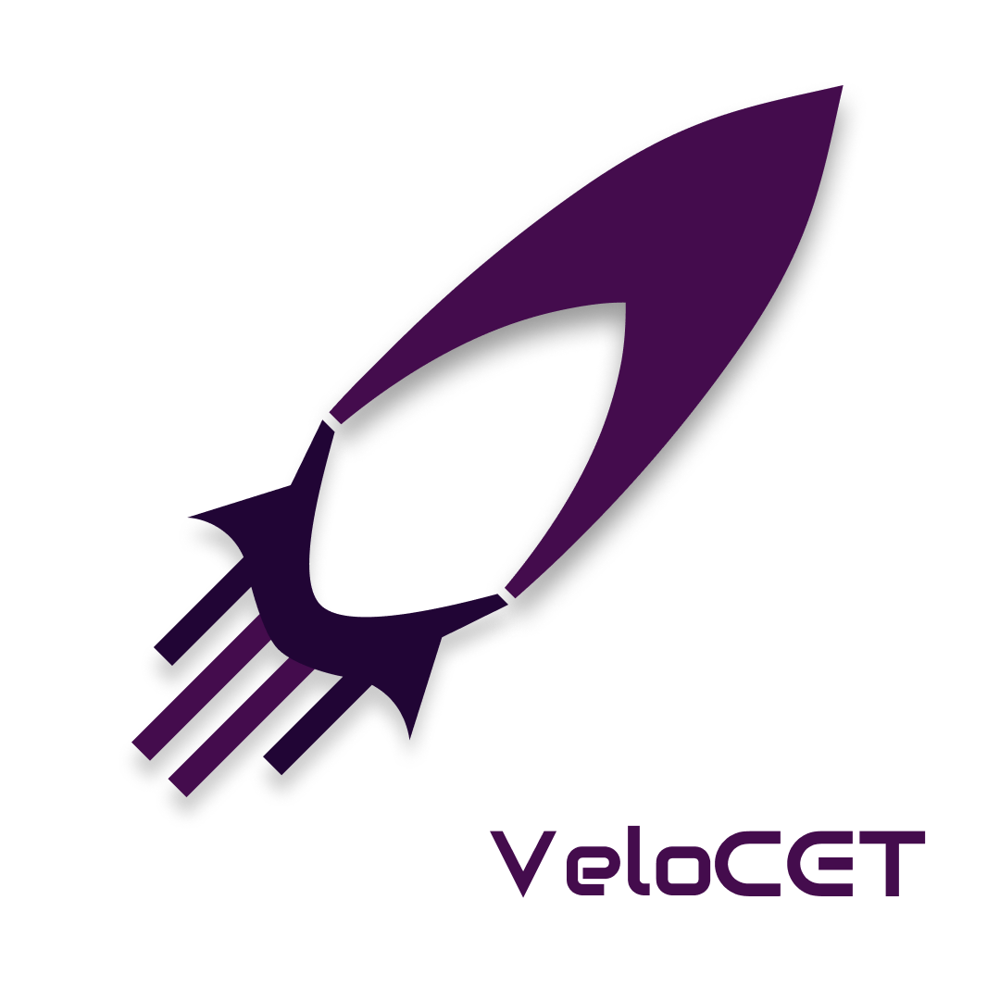

  

<h1 align="center">🚀 VeloCET</h1>
<h2 align="center">Official model rocketry club of College of Engineering Trivandrum</h2>

   "Defying Gravity, Defining Innovation"

---

## 🌟 About VeloCET
VeloCET is the official rocketry club of **College of Engineering Trivandrum**, dedicated to advancing student-led aerospace engineering.  
We work across **mechanical**, **aerodynamics**, **propulsion**, **avionics**, **simulations**, and **recovery systems** to build rockets capable of competing at national and international stages.

Our mission is simple:  
**Engineer reliable rockets through rigorous design, scientific thinking, and disciplined testing.**

---

## 🛰️ Subsystems
VeloCET operates as a unified engineering team with specialized divisions:

### **• Structures**
Design of airframes, fins, bulkheads, nosecones, payload bays, and mechanisms using CAD and FEA tools.

### **• Aerodynamics**
Flight stability, drag modeling, CFD analysis, performance prediction, and optimization.

### **• Propulsion**
Solid motor design, static testing, grain geometry, burn profiles, and thrust curve validation.

### **• Avionics**
Flight computer firmware, sensor fusion, telemetry systems, ground station, and recovery automation.

### **• Recovery**
Parachute deployment mechanisms, ejection systems, redundancy design, and safety verification.

### **• Simulations & Analysis**
Trajectory prediction, Monte-Carlo modelling, post-flight data analysis, and mission planning tools.

---

## 📂 Repository Structure
Most engineering repositories are private to protect competitive and safety-critical designs.

### **Private Repositories (Core Engineering)**
- `flight-computer` — Avionics firmware and control logic  
- `ground-station` — Mission control and telemetry tools   
- `payload` = Latest of our payload design and ideas

### **Public Repositories (Outreach & Tools)**
- `website` — Official VeloCET website   
- `docs` — Public-facing documentation and resources  

---

## 🛠️ Engineering Philosophy
- Systems-level thinking  
- Iterative design → prototyping → testing → flight validation  
- Strict version control and review workflow  
- Reliability and safety as primary constraints  
- Strong documentation culture  

Every subsystem follows a structured engineering pipeline to maintain consistency across projects.

---

## 🏆 Achievements
*(Visit our Linkedin handle for details of our recent achievements)*

---

## 🌐 Contact Us
- **Email:** velocet@cet.ac.in  
- **Instagram:** [@velo_cet](https://instagram.com/velo_cet)  
- **Website:** <https://velo.cet.ac.in>

---

